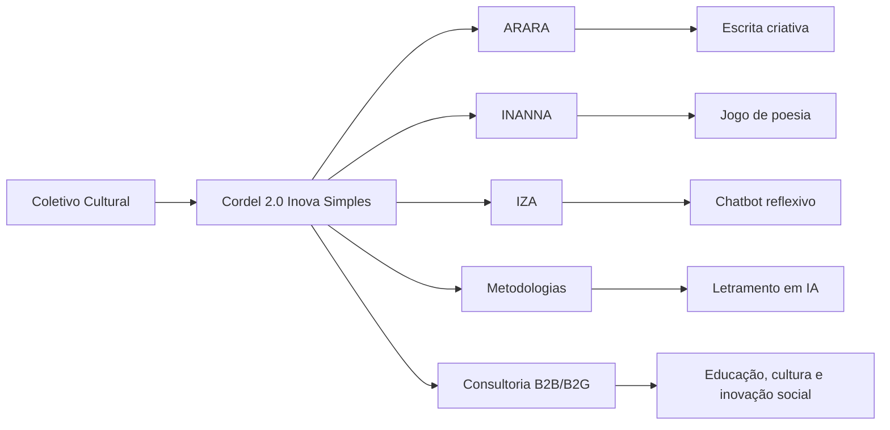

<div align="center">

  

  # 📜 Cordel 2.0 — Inova Simples I.S.

  ### Inovação · Criação · Letramento em IA

  **Inteligência Artificial, Economia Criativa, Autoria Humana**

  <br>

  [](https://www.cordel2pontozero.com)
  [](https://github.com/cordel2pontozero)
  [](https://www.instagram.com/cordel2pontozero)
  [](https://www.linkedin.com/company/106189789/admin/dashboard/)

  <br>

  

</div>

---

## 💡 Sobre nós

O **Cordel 2.0 Inova Simples I.S.** é uma startup brasileira de base cultural, educacional e tecnológica. Nascemos da experiência do **Coletivo Cultural Cordel 2.0**, nosso celeiro criativo e pilar territorial.

Unimos **literatura de cordel**, **escrita criativa**, **educação**, **inteligência artificial generativa** e **inovação social** para criar experiências de letramento digital em IA com sentido pedagógico, cultural e humano.

Mais do que desenvolver aplicativos, construímos um ecossistema formado por:

- software educacional;
- método pedagógico;
- oficinas e jornadas formativas;
- curadoria cultural;
- acompanhamento humano;
- pesquisa crítica sobre IA, autoria e educação.

Acreditamos que o futuro tecnológico não pode ser privilégio de poucos. A IA precisa dialogar com escolas, periferias, bibliotecas, coletivos culturais, educadores, jovens, artistas e comunidades que reinventam linguagem todos os dias.

> **Não fazemos tecnologia para substituir a criação humana.**
> **Fazemos tecnologia para ampliar autoria, imaginação, aprendizagem e justiça social.**

---

## 🚀 O que fazemos

Atualmente, o Cordel 2.0 desenvolve um ecossistema de soluções para **letramento digital em Inteligência Artificial por meio da escrita**.

- 🧠 **IA na Educação**
  Criamos experiências para compreender, questionar e usar IA generativa com responsabilidade.

- ✍️ **Escrita Criativa e Cordel**
  Desenvolvemos metodologias que unem tradição oral, poesia popular, rima, autoria e tecnologia.

- 🎮 **Apps e Jogos Educativos**
  Criamos protótipos como ARARA, INANNA e IZA para aprendizagem, criação e reflexão.

- 🌎 **Atuação Territorial**
  Trabalhamos com cultura popular, periferias urbanas, escolas, bibliotecas e redes comunitárias.

- 🤝 **B2B e B2G**
  Desenvolvemos soluções para empresas, instituições, governos, programas públicos e organizações culturais.

---

## 🛠️ Skills & Tech Stack

<div align="center">


</div>

| Campo | Ferramentas |
|---|---|
| IA & NLP | Python, prompts, LLMs, Hugging Face, OpenAI API |
| Web | HTML, CSS, JavaScript, Node.js |
| Deploy | Vercel, Netlify, GitHub Pages |
| Design | Figma, Canva, prototipagem |
| Educação | oficinas, jornadas, letramento em IA |
| Cultura | cordel, oralidade, curadoria, autoria |

---

## 🧩 Arquitetura do ecossistema



---

## 📦 Projetos em destaque

### 🦜 ARARA

`Em desenvolvimento`

[](https://cordel2pontozero.github.io/arara-apresentacao-oficial/)

Aplicativo voltado à escrita de cordel, criação poética e experimentação com IA generativa. A proposta une palavra, imagem, oralidade e autoria para estimular processos de criação com identidade cultural.

**Eixos:** `cordel` · `escrita criativa` · `IA generativa` · `autoria`

---

### 🔮 INANNA Proto-IA Educativa

`MVP`

[](https://cordel2pontozero.github.io/Inanna-apresentacao-oficial/)

Jogo de poesia e autoria que valoriza a decisão humana diante das sugestões preditivas da IA. O objetivo é mostrar, de forma gamificada, que a melhor rima não é necessariamente a mais provável, mas aquela que nasce da criação, da verossimilhança e da intenção humana.

**Eixos:** `game educativo` · `poesia` · `rima` · `agência humana`

---

### 💬 IZA Chatbot Reflexivo

`Alpha`

[](https://cordel2pontozero.github.io/Iza-apresentacao-oficial/)

Chatbot educacional criado para provocar perguntas, reflexões e diálogos sobre tecnologia, literatura, ética, autoria e inteligência artificial. A IZA parte de uma ideia simples: perguntar também é uma forma de pensar.

**Eixos:** `chatbot` · `educação` · `ética em IA` · `mediação reflexiva`

---

### 📚 Metodologias Cordel 2.0

`Pesquisa e formação`

Repositório dedicado a oficinas, jornadas criativas, materiais pedagógicos, protocolos formativos e documentação aberta sobre letramento em IA, cultura popular e escrita criativa.

**Eixos:** `oficinas` · `educação` · `formação docente` · `cultura digital`

---

## 🤖 IA no coração do processo

```
┌─────────────────────────────────────────────────────────────────┐
│                                                                 │
│   voz humana  ──►  prompt  ──►  LLM  ──►  sugestão            │
│                                   │                             │
│                              ◄────┘                             │
│            curadoria · crítica · autoria · cordel               │
│                                                                 │
└─────────────────────────────────────────────────────────────────┘
```

No Cordel 2.0, a IA não decide — ela propõe. A decisão final é sempre do poeta, da educadora, do estudante. Trabalhamos com modelos de linguagem de grande escala (LLMs) como ferramentas de **amplificação criativa**, nunca de substituição.

---

## 🧭 Roadmap do protótipo

| TRL   | Marco                       | Status |
| ----- | --------------------------- | ------ |
| TRL 1 | Princípios                  | ✅ |
| TRL 2 | Conceito técnico-pedagógico | ✅ |
| TRL 3 | Prova de conceito cultural  | ✅ |
| TRL 4 | Protótipo em laboratório    | ✅ |
| TRL 5 | Ambiente relevante          | 🔄 |
| TRL 6 | Protótipo funcional         | 🔄 |
| TRL 7 | Demonstração operacional    | ⏳ |
| TRL 8 | Produto validado            | ⏳ |
| TRL 9 | Operação com clientes       | ⏳ |

<details>
<summary>📌 Ver foco atual do roadmap</summary>

Estamos consolidando a passagem do **Coletivo Cultural Cordel 2.0** para uma startup de inovação com protótipos educacionais, documentação técnica, validação territorial e produtos voltados ao letramento crítico em IA.

A prioridade atual é estruturar o ecossistema em três frentes:

- **Produto:** ARARA, INANNA e IZA;
- **Método:** oficinas, formação e curadoria;
- **Mercado:** parcerias B2B, B2G e projetos territoriais.

</details>

---

## 🌍 Onde atuamos

- Salvador, Bahia, Brasil;
- Região Metropolitana de Salvador;
- escolas, bibliotecas e espaços culturais;
- territórios periféricos e comunidades criativas;
- projetos com empresas, governos e organizações culturais.

---

## 🤝 Para quem construímos

Desenvolvemos soluções para:

- escolas e redes de ensino;
- universidades e grupos de pesquisa;
- secretarias e políticas públicas;
- empresas e institutos;
- organizações culturais;
- coletivos, bibliotecas e comunidades;
- educadores, estudantes, artistas e escritores.

---

## 📊 Atividade técnica em transição

<div align="center">

[](https://github.com/outcast2020)

</div>

---

## 📬 Contato e redes sociais

<div align="center">

[](https://www.cordel2pontozero.com)
[](mailto:contato@cordel2pontozero.com)
[](https://www.instagram.com/cordel2pontozero)
[](https://www.linkedin.com/company/106189789/admin/dashboard/)

<br>

*"A tecnologia que não fala a língua do povo não serve ao povo."*

</div>
