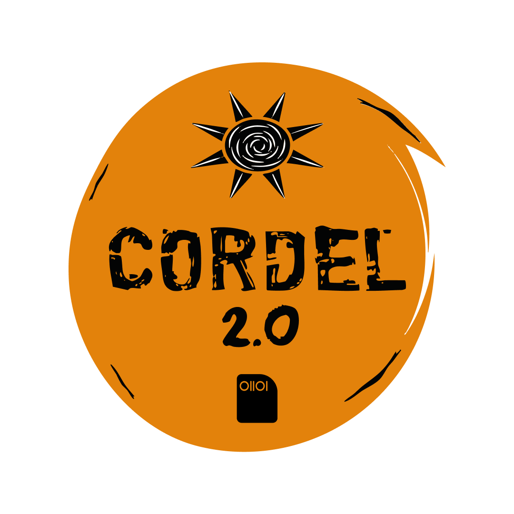
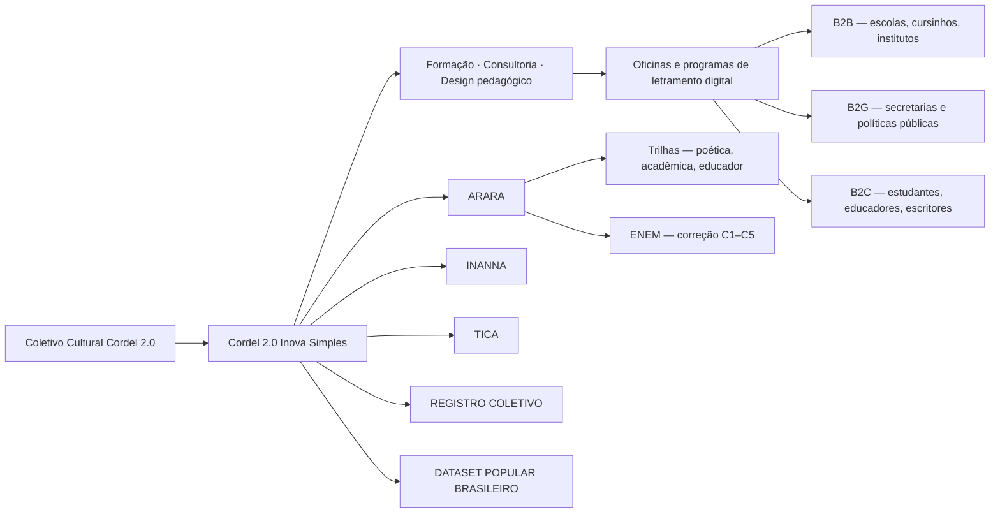

<div align="center">



  # 📜 Cordel 2.0 - Educação, Cultura e Inovação.

### Formação · Consultoria · Design pedagógico

**Exportamos aprendizado. O software é o meio.**

<br>

[](https://www.cordel2pontozero.com)
[](https://www.instagram.com/cordel2pontozero)
[](https://www.linkedin.com/company/cordel2pontozero/)
[](mailto:contato@cordel2pontozero.com)

<br>


</div>

---

## 💡 O que somos

O **Cordel 2.0 Inova Simples I.S.** é uma startup brasileira de **formação, consultoria e
design pedagógico**. Nascemos da experiência do **Coletivo Cultural Cordel 2.0**, nosso
celeiro criativo e pilar territorial.

O que entregamos é **aprendizado**: oficinas e programas de **letramento digital, leitura e
escrita**, com método, curadoria e acompanhamento humano.

Para sustentar essa formação, desenvolvemos **cinco softwares próprios** — feitos em casa,
não licenciados de terceiros nem revendidos. Eles não são o produto: são o **meio** pelo
qual a formação acontece.

> **Não fazemos tecnologia para substituir a criação humana.**
> **Fazemos tecnologia para ampliar autoria, imaginação, aprendizagem e justiça social.**

## 🤝 Como exportamos aprendizado

| Frente | O que oferecemos |
|---|---|
| **B2B** | Escolas, redes privadas, cursinhos, institutos e empresas: programas de escrita, preparação para o ENEM e formação de equipes docentes. |
| **B2G** | Secretarias, políticas públicas, bibliotecas e programas territoriais: oficinas de letramento digital em rede pública, com relatórios institucionais. |
| **B2C** | Estudantes, educadores, poetas e escritores: acesso direto às plataformas, ao simulador de redação ENEM e às jornadas de escrita. |

O **simulador de redação ENEM** atende às três frentes com o mesmo motor de correção — o que
muda é o desenho da formação em volta dele.

## 📦 Os cinco softwares próprios

### 🦜 ARARA — Trilhas e ENEM

`Em produção`

[](https://arara.cordel2pontozero.com)
[](https://github.com/Cordel2pontozero/arara-apresentacao-oficial)

Plataforma de escrita em **duas versões, mesma origem**:

- **Trilhas** — escrita poética e acadêmica, Motor H2 e Espaço do Educador;
- **ENEM** — correção de redação com **dupla leitura independente** e notas **C1–C5**
  ancoradas na matriz do INEP, em produção desde 22/06/2026.

A correção foi **validada contra 385 redações periciadas por dois especialistas humanos
cada**, com manifesto de integridade — inclusive publicando um defeito nosso que
encontramos e corrigimos.

**Eixos:** `escrita` · `redação ENEM` · `mediação docente` · `evidência`

---

### 🔮 INANNA — Proto-IA educativa

`Em produção`

[](https://inanna.cordel2pontozero.com)
[](https://github.com/Cordel2pontozero/Inanna-apresentacao-oficial)

Jogo de cordel que **abre a caixa-preta da próxima palavra**: mostra candidatos e
probabilidades e premia quando a escolha humana rompe a previsão da máquina.

Explicar um modelo de linguagem é abstrato. Perder uma rima para ele não é.

**Eixos:** `game educativo` · `poesia` · `rima` · `agência humana`

---

### 💬 TICA — Chatbot reflexivo

`Produção controlada`

[](https://tica.cordel2pontozero.com)
[](https://github.com/Cordel2pontozero/tica-apresentacao-oficial)

Escrita guiada por perguntas. Herda **o espelho de ELIZA** e **a maiêutica socrática**, e
conversa em cordel. O worker **Curupira** atua como consciência sintática **não-aditiva**:
reveste a forma, nunca introduz conteúdo novo.

> *Este produto já se chamou **IZA**.*

**Eixos:** `chatbot` · `escrita guiada` · `ética em IA` · `mediação reflexiva`

---

### 🗺️ REGISTRO COLETIVO — Território e xilogravura

`Protótipo`

[](https://territorio.cordel2pontozero.com)
[](https://github.com/Cordel2pontozero/registro-coletivo-apresentacao)

Registro vivo de escrita popular e xilogravura **ancorado no chão onde cada obra nasce**,
com um construtor de espaços culturais em 3D para a comunidade erguer, sem código, os
lugares citados nas obras.

Primeiro território: entorno do **Espaço Cultural Alagados**, Salvador.

**Eixos:** `território` · `patrimônio vivo` · `cordel` · `dados abertos`

---

### 📚 DATASET POPULAR BRASILEIRO — Acervo aberto

`Aberto e colaborativo`

[](https://cordel2pontozero.github.io/dataset-popular-Brasileiro/)
[](https://github.com/Cordel2pontozero/dataset-popular-Brasileiro)

Palavras, expressões e referências da cultura popular brasileira — a língua
sub-representada nos corpora que treinam sistemas de linguagem.

**Aberto por decisão:** o software é nosso, a língua não é.

**Eixos:** `dados abertos` · `cultura popular` · `NLP` · `bem comum`

---

## 🧩 Arquitetura do ecossistema



## 🤖 IA no coração do processo

```
┌─────────────────────────────────────────────────────────────────┐
│                                                                 │
│   voz humana  ──►  prompt  ──►  LLM  ──►  sugestão              │
│                                   │                             │
│                              ◄────┘                             │
│            curadoria · crítica · autoria · cordel               │
│                                                                 │
└─────────────────────────────────────────────────────────────────┘
```

No Cordel 2.0, a IA não decide — ela propõe. A decisão final é sempre do poeta, da
educadora, do estudante. Trabalhamos com modelos de linguagem como ferramentas de
**amplificação criativa**, nunca de substituição.

## 🧭 Maturidade tecnológica (TRL)

Escala TRL aplicada **dispositivo a dispositivo**, e não ao conjunto.

### Situação por dispositivo

| Dispositivo | TRL 7 | Em andamento | Estado |
|---|:---:|---|---|
| **ARARA ENEM** — corretor de redação | ✅ | — | **TRL 9 ✅** — operação com usuários reais, validado contra corpus pericial |
| **ARARA Trilhas** | ✅ | TRL 8 → 9 | Em produção; consolidando validação em uso institucional |
| **INANNA** | ✅ | TRL 8 → 9 | Em produção; ampliando uso em turmas e oficinas |
| **TICA** | ✅ | TRL 8 → 9 | Produção controlada; avançando por gates humanos |
| **REGISTRO COLETIVO** | ✅ | TRL 8 → 9 | Território no ar; aguarda oficina de construção com a comunidade |

### Leitura da escala

| TRL | Marco | Estado |
| --- | --- | --- |
| TRL 1 | Princípios | ✅ |
| TRL 2 | Conceito técnico-pedagógico | ✅ |
| TRL 3 | Prova de conceito cultural | ✅ |
| TRL 4 | Protótipo em laboratório | ✅ |
| TRL 5 | Ambiente relevante | ✅ |
| TRL 6 | Protótipo funcional | ✅ |
| TRL 7 | Demonstração operacional | ✅ **todos os dispositivos** |
| TRL 8 | Produto validado | 🔄 em andamento · ✅ ARARA ENEM |
| TRL 9 | Operação com clientes | 🔄 em andamento · ✅ ARARA ENEM |

**Todos os cinco dispositivos alcançaram o TRL 7.** O **corretor de redação do ENEM** é o
primeiro a fechar o **TRL 9**, sustentado por bancada de evidências com 385 redações
periciadas por dois especialistas humanos cada, 179 redações nota 1000 como teto de
referência e manifesto SHA256 amarrando dados, resultados e código.

Os demais avançam nos **TRL 8 e 9**, consolidando validação em uso institucional.

## 🛠️ Tecnologia

<div align="center">


</div>

| Campo | Ferramentas |
|---|---|
| Aplicações | Next.js, React, TypeScript, Astro, JavaScript |
| Dados | Supabase, Postgres, Row Level Security, Edge Functions |
| IA & NLP | LLMs, workers dedicados, motores determinísticos, avaliação por rubricas |
| Deploy | Vercel, Cloudflare, GitHub Pages |
| Design | Figma, design system próprio, prototipagem |
| Educação | oficinas, jornadas, formação docente, letramento digital |
| Cultura | cordel, oralidade, curadoria, autoria, território |

## 🌍 Onde atuamos

- Salvador, Bahia, Brasil;
- Região Metropolitana de Salvador;
- escolas, bibliotecas e espaços culturais;
- territórios periféricos e comunidades criativas;
- projetos com empresas, governos e organizações culturais.

## 🤝 Para quem construímos

- escolas e redes de ensino;
- cursinhos e programas de acesso ao ensino superior;
- universidades e grupos de pesquisa;
- secretarias e políticas públicas;
- empresas e institutos;
- organizações culturais, coletivos e bibliotecas;
- educadores, estudantes, artistas e escritores.

## 📄 Licenciamento e propriedade

Os softwares do ecossistema seguem regimes distintos, declarados em cada repositório:

| Software | Regime |
|---|---|
| **ARARA** | Software proprietário — todos os direitos reservados |
| **INANNA** | Vitrine sob MIT; conteúdo em CC BY-ND 4.0 |
| **TICA** | Vitrine sob MIT; conteúdo em CC BY-ND 4.0 |
| **REGISTRO COLETIVO** | Conteúdo em CC BY-ND 4.0; base cartográfica em ODbL |
| **DATASET POPULAR BRASILEIRO** | Aberto sob MIT — por decisão |

Textos institucionais e identidade visual do Cordel 2.0 seguem **CC BY-ND 4.0**.

---

## 📬 Contato

<div align="center">

[](https://www.cordel2pontozero.com)
[](mailto:contato@cordel2pontozero.com)
[](https://www.instagram.com/cordel2pontozero)
[](https://www.linkedin.com/company/cordel2pontozero/)

<br>

**CORDEL 2.0 INOVA SIMPLES (I.S.)**
CNPJ 66.466.887/0001-16
Salvador — Bahia — Brasil

<br>

*"A tecnologia que não fala a língua do povo não serve ao povo."*

</div>
